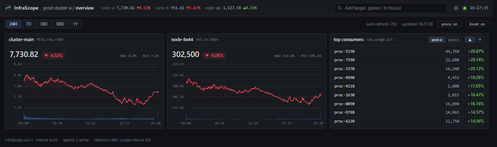

# InfraScope

겉보기에는 Grafana 스타일의 서버 모니터링 대시보드, 실제로는 **실시간 주식 시세 뷰어**입니다.



위 화면에서 `zone-a`는 코스피 지수, `cluster-main` 패널은 코스피 차트, `node-8e44`는 삼성전자, "top consumers" 테이블은 급등주 랭킹입니다. 차트 하단 파란 막대는 거래량이고, 패널의 `http.req.rate` 같은 라벨은 값 크기에 맞게 자동 선택되는 가짜 메트릭 이름입니다.

## 특징

- **국내 시세 실시간급** — 코스피/코스닥 종목·지수를 네이버 차트 API(1분봉)로 조회, 자동 갱신 (기본 20초, 설정에서 10/20/60초)
- **해외 시세** — 미국 주식·지수·환율 등은 Yahoo Finance (거래소에 따라 지연 가능)
- 한글 종목명 / 영문 / 종목코드 검색, 급등·급락 랭킹, 헤더 시장 요약 티커, 거래량 차트
- 보스키(ESC), 탭 이탈 시 자동 가림, 별칭↔실명 토글 등 다층 위장 장치
- **두 가지 실행 방식** — Chrome 확장(서버리스) 또는 로컬 Python 서버. UI 한 벌(`extension/index.html`)을 공유
- **의존성 0** — Python 표준 라이브러리만 사용, 확장도 외부 라이브러리 없음

## 실행 방법 (두 가지)

### A. Chrome 확장 (권장 — Python 불필요)

확장은 `host_permissions`로 CORS 없이 직접 시세를 가져오므로 별도 서버가 필요 없습니다.

1. Chrome 주소창에 `chrome://extensions` 입력
2. 우측 상단 **개발자 모드** 켜기
3. **압축해제된 확장 프로그램 로드** → 이 저장소의 `extension/` 폴더 선택
4. 툴바의 InfraScope 아이콘 클릭 → **사이드 패널**로 열림 (다른 작업 옆에 띄워두기 좋음)
5. 전체 탭으로 보려면 설정(`⚙`) → **open in full tab**

데이터·UI·위장 장치는 서버판과 100% 동일합니다.

### B. 로컬 Python 서버

**Windows**: `start.bat` 더블클릭 (서버 시작 후 브라우저 자동 오픈)

**macOS / Linux**:

```sh
python3 server.py    # Python 3.8+, 외부 패키지 불필요
```

브라우저에서 http://127.0.0.1:8137 접속. 서버는 `127.0.0.1`에만 바인딩되므로 같은 네트워크의 다른 사람은 접속할 수 없습니다. 포트를 바꾸려면 `server.py` 상단의 `PORT` 상수를 수정하세요.

## 사용법

| 기능 | 방법 |
|---|---|
| 종목 검색/추가 | 상단 검색창에 `삼성전자`, `AAPL`, `kospi` 등 입력 (단축키 `/`) |
| 종목 제거 | 패널에 마우스 올리면 나오는 `✕` |
| 별칭 변경 | 패널 제목 더블클릭 (예: 삼성전자 → `web-01`) |
| 패널 순서 변경 | 패널 헤더(제목 줄)를 드래그해서 원하는 위치에 놓기 — 랭킹 패널 포함 전부 이동 가능, 자동 저장. `ESC`나 창 밖에 놓으면 취소 |
| 실제 종목명 확인 | 제목에 마우스 올리기 (툴팁) |
| **보스키** | **`ESC`** — 검색 중이든 뭐든 한 번에 가짜 서버 로그 화면으로 전환 / 복귀 |
| **자동 보스키** | 다른 탭으로 이동하거나 브라우저를 최소화하면 자동으로 로그 화면 전환 — 돌아왔을 때 항상 로그가 먼저 보임. 다른 창에서 작업할 때(탭은 계속 보이는 상태)는 발동 안 함. 복귀는 `ESC`(수동). 툴바의 `kiosk: on/off`로 토글 |
| 실명 ↔ 별칭 전체 토글 | `` ` `` (백틱) — 켜져 있으면 우상단 점이 파란색. 새로고침하면 항상 별칭으로 복귀 |
| 기간 변경 | 24H / 7D / 30D / 90D / 1Y 버튼 |
| 차트 확대 | 패널의 `⤢` 버튼 |
| 급등/급락 랭킹 | "top consumers" 패널 — `pool-a/b` = 코스피/코스닥, `▲/▼` = 급등/급락. 행 클릭하면 관심 종목에 추가. 패널의 `✕` 또는 툴바 `procs: on/off`로 닫고, 다시 켜는 건 툴바 버튼 |
| 시장 요약 티커 | 헤더의 `zone-a / zone-b / edge-gw` = 코스피 / 코스닥 / 달러환율 |
| **설정** | 헤더 우측 `⚙` — 가격만 보기(차트 숨김, 컴팩트 패널), 거래량 막대 on/off, 헤더 티커 on/off, 한국식 색상(빨강=상승/파랑=하락), 시작 시 로그 화면으로 부팅, 갱신 주기(10/20/60초) |

## 위장 요소

- 종목명은 `node-a3f2` 같은 호스트명 별칭으로 표시 (랭킹은 `proc-5150` 형태)
- 각 패널에 값 크기에 맞는 가짜 메트릭 이름 자동 표기 — 소수점이 불가능한 라벨(`queue.depth` 등)에 소수점 값이 붙는 일이 없도록 설계
- 검색 결과의 거래소명(KOSPI/NYSE 등)은 `ap-ne2-a` 같은 가짜 클라우드 존 이름으로 표시
- 실명 모드는 절대 저장되지 않음 — 다시 열면 항상 위장 상태로 시작
- 탭 제목·파비콘·푸터 문구(`retention: 90d · scrape interval 20s`)까지 모니터링 도구 행세
- 브라우저는 금융 도메인과 직접 통신하지 않음 — 주소창과 개발자 도구 네트워크 탭에도 `127.0.0.1`만 보임

## 동작 방식

```
확장:   확장 페이지 ──(host_permissions, CORS 우회)──→ 네이버 증권 / Yahoo Finance
서버:   브라우저 ←HTTP→ server.py (127.0.0.1:8137) ←HTTPS→ 네이버 증권 / Yahoo Finance
```

UI(`extension/index.html`)는 `apiGet()`을 통해 데이터에 접근합니다. 확장에서는 `marketdata.js`가 `window.InfraData`를 채워 직접 호출하고, Python 서버가 띄운 페이지(`http://`)에서는 `chrome.runtime.id`가 없어 그 계층이 비활성화되고 아래 `/api` 프록시로 폴백합니다. `server.py`와 `marketdata.js`는 동일한 변환 로직을 각각 Python/JS로 구현합니다.

- `search` — 네이버 자동완성(국내) + Yahoo 검색(해외) 병합. 코스피/코스닥 지수는 직접 매핑
- `chart` — 국내 심볼(`6자리.KS/.KQ`, `^KS11`, `^KQ11`)은 네이버, 그 외는 Yahoo로 라우팅. 응답은 Yahoo v8 차트 형식으로 통일되어 UI는 출처를 구분하지 않음
- `rank` — 네이버 급등/급락 랭킹
- 네이버 분봉의 누적 거래량은 분당 증분으로 변환
- 10초 캐시 + 단일 비행(single-flight)으로 동일 요청의 업스트림 중복 호출 방지

## 주의 사항

- 네이버·Yahoo의 **비공개/비공식 API**를 사용합니다. 예고 없이 변경되거나 차단될 수 있으며, 해당 서비스의 약관과 충돌할 수 있습니다. **개인적인 용도로만 사용하세요.**
- 시세는 참고용입니다. 투자 판단과 그 결과에 대한 책임은 사용자 본인에게 있습니다.
- 설정(관심 종목, 별칭, 토글 상태)은 브라우저 localStorage에만 저장되며 외부로 전송되지 않습니다.
